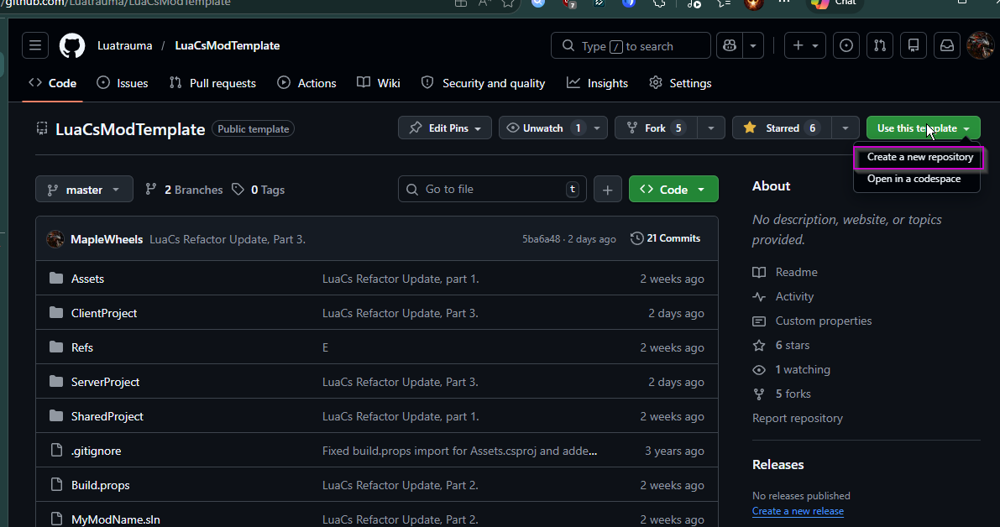
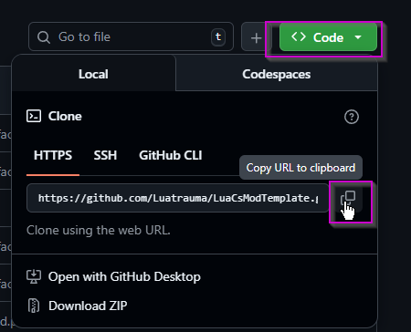
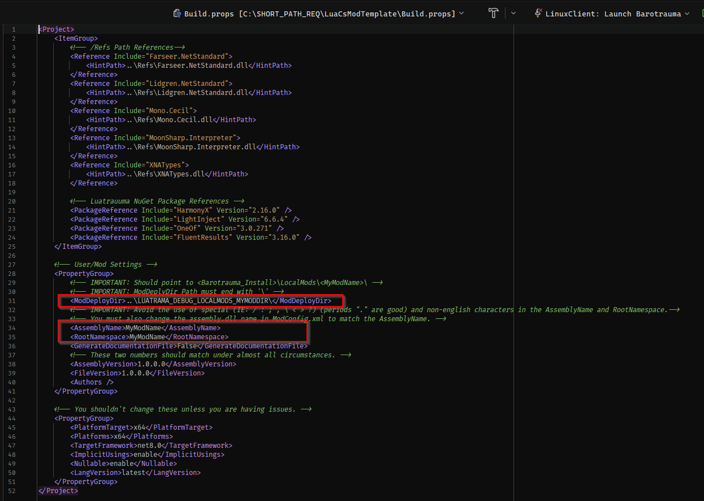
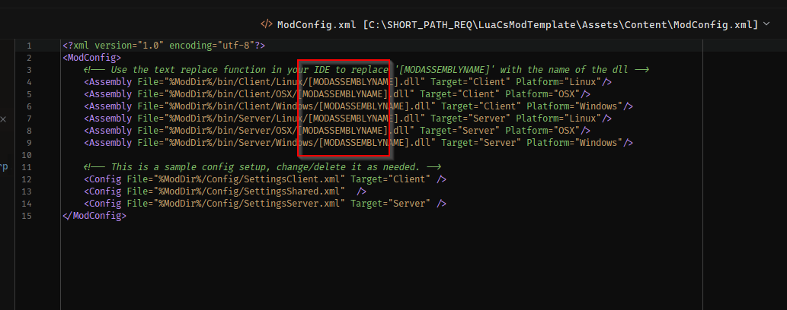
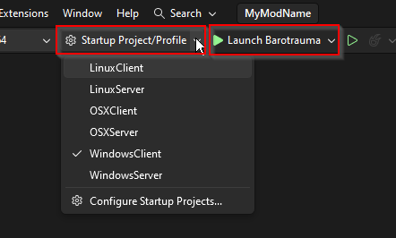
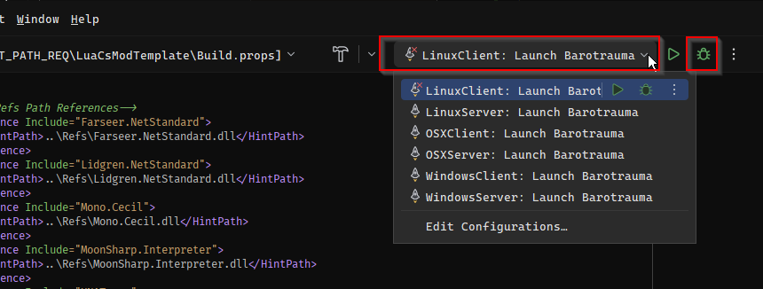
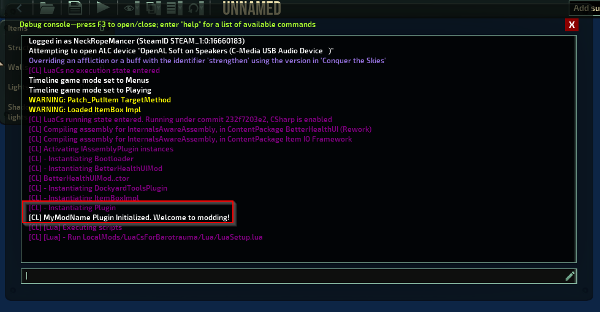

# Assembly (C#) Mod

Last Updated: 2026-04-09 
This type of mod creates compiled binaries/dll without code written in C#/.NET. The benefits of this workflow and mod type compared to a Lua mod are:

> - Complete access to all Barotrauma functions.
> - Better performance.
> - Much faster loading for players.
> - Custom game objects (ie. ItemComponents).
> - Smart autocomplete and documentation.
> - Hot Reload/Edit-and-Continue (edit code while it's running).
> - Strong error checking and live debugging support.

The cons are:
> - Players must have C# mods enabled.
> - More complex language.
> - The project requires more setup.
> - Mods may need to be recompiled every few updates (9-12 months) if there are major game changes.

## Getting Started

---

### 1. IDE Setup

You will need an IDE that supports `.NET 8` as a platform/SDK target. The following IDEs have been tested with the project and should work out of the box:
> - [Visual Studio Community Edition](https://visualstudio.microsoft.com/vs/community/)
> - [JetBrains Rider IDE](https://www.jetbrains.com/rider/download/?section=windows)

You may use another IDE but it will be up to you to fix any issues arising from it.

### 2. Git Installation (highly recommended)

Git is *the industry standard* for version control and is completely free. It allows you to save your work, revert back to previous versions, collaborate with others and more. It is not required but very helpful. [Download it here](https://git-scm.com/install/) and install it.

We will be using Git in the installation going forward.

### 3. Create the Project

- Create/Log in to your Github account and then go to [LuaCsModTemplate](https://github.com/Luatrauma/LuaCsModTemplate).
- In the top-right corner, click `Use this Template`.
- Name the repository the name of your mod.
 
>  

### 4. Clone/Create Local Mod Copy
- In your new github repo, select the green `<> Code` button and copy the HTTPS repo link.
- Go to the directory on your PC where you want to store the project.
 
> 
- Open Git Bash or CMD in that folder/directory (Google how to for your platform).
- in the terminal type: `git clone <paste your repo link here>` and press enter.
- When completed, verify that the folder matches what you see on your Github repo.

### 5. Setup the Project
- Download the [Luatrauma reference dlls](https://github.com/MapleWheels/LuaCsForBarotrauma/releases/download/latest/luacsforbarotrauma_refs.zip) zip file and extract the contents into the `/Refs/` folder in your project.
- Open `Build.props` in the main directory and go to the `User/Mod Settings` section.
- Replace `ModDeployDir` with the path to your Barotrauma local mods, ie. `<BarotraumaGame>/LocalMods/<YourModName>/`:
> - Note: ModDeployDir must end with a '\\'
> - Example: "C:\Program Files (x86)\Steam\steamapps\common\Barotrauma\LocalMods\MyModName\\"
- Replace `AssemblyName` and `RootNamespace` with your mod's name using the following rules:
> - No spaces
> - No special characters (ie.  < >, \ / ;). Periods (.) are allowed.
> - Use English characters only
 
>   

- Copy the `AssemblyName` and then open `Assets/Content/ModConfig.xml`.
- Replace `[MODASSEMBLYNAME]` with your `AssemblyName` (keep the .dll ending).
> Tip: Use Notepad++ or another editor's 'Find and Replace' function.

  
- In the main directory, rename `MyModName.sln` to your mod's name.

### 6. Test the Project.
- Open the renamed `<MyModName.sln>`.
- Build the project.
- In the top bar, select the Startup Project, then Launch Option / Configuration for your system (ie. `WindowsClient: Launch Barotrauma` ).
 
 
**Visual Studio**:
 
>  
 
 
**Jetbrains Rider**:
 
>  

- On the Main Menu, **add your mod to the Enabled Packages/Mods list.**
- Go into the Sub Editor and open the console.
- Check to see if your mod was loaded in the console.
 
>  

If your mod loaded successfully, you are now ready to mod!

--- 

## Project Structure and Where to Code

**Your entry point/startup for your code** is `SharedProject/SharedSource/Plugin.cs`.

All of your mod's non-code content should be put in `./Assets/Content/`. 
All of your Client-only code should be in `ClientProject/ClientSource`. 
All of your Shared code should be in `SharedProject/SharedSource`. 
All of your Server-only code should be in `ServerProject/ServerSource`. 

Vanilla files should be added to `Assets/Content/filelist.xml` as per normal XML modding.
Modded LuaCs-specific files is added via `Assets/Content/ModConfig.xml`.

For more details on `ModConfig.xml` and the LuaCs API, see the [API pages](development/modconfig.md).

